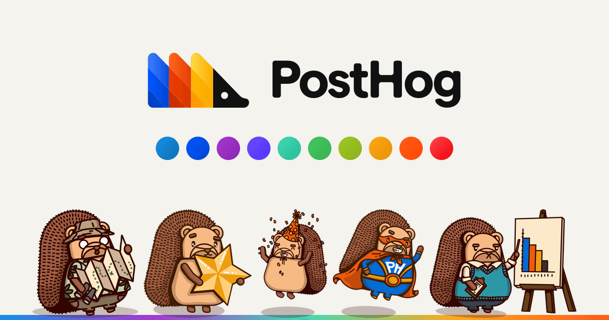

# @posthog/brand

[](https://brand.posthog.com)

Every PostHog brand asset in one npm package: the **logo**, the **colors**, the **font**
(RoundHog), 160+ **hedgehogs**, and the team **crests** — as React components, raw SVGs, PNG
URLs, color tokens, and `woff2` files. All bundled, so **nothing is fetched at runtime**.

```bash
pnpm add @posthog/brand
```

> 🦔 **[brand.posthog.com](https://brand.posthog.com)** has every asset with the import line
> for each one. Browse there, come back here for the API.

> ⚠️ **Pre-1.0.** While we're on `0.x`, exports can be renamed or removed in a **minor** bump.
> Pin an exact version if that would ruin your week; we'll follow semver strictly from `1.0.0`.

## Five subpaths, five kinds of asset

```tsx
import { Logo } from "@posthog/brand/logo"
import { colors } from "@posthog/brand/colors"
import { roundHogFontFaceCss } from "@posthog/brand/fonts/css"
import { HedgehogDoctorHog } from "@posthog/brand/hoggies"
import { MarketingCrest } from "@posthog/brand/crests"
```

Import from the subpath you need; nothing else tags along. Every illustration takes two
friendly props — **`size`** (the width; height follows the artwork's aspect ratio, so nothing
stretches) and **`title`** (an accessible label; without one the image is decorative) — plus
any other `<svg>` prop, and carries its own metadata as a static `.meta`. Hover a component in
your editor and the TSDoc tells you the rest.

## Logo

```tsx
import { Logo } from "@posthog/brand/logo"

<Logo />                                  // landscape, full gradient (the defaults)
<Logo variant="mono" color="#fff" />      // one color, e.g. on a dark background
<Logo variant="print" layout="stacked" /> // 4-color/CMYK, portrait
<Logo.Logomark />                         // just the hog
<Logo.Wordmark />                         // just the word
```

| Prop      | Values                                                    | Default        |
| --------- | --------------------------------------------------------- | -------------- |
| `variant` | `"gradient"` · `"print"` (4-color/CMYK) · `"mono"`        | `"gradient"`   |
| `layout`  | `"landscape"` · `"stacked"` · `"logomark"` · `"wordmark"` | `"landscape"`  |
| `color`   | any CSS color — `mono` only                               | `currentColor` |

A `mono` logo (and the always-mono wordmark) draws with `currentColor`, so it picks up the
surrounding text color unless you say otherwise.

## Colors

A plain object. No React, no markup, no surprises.

```ts
import { colors } from "@posthog/brand/colors"

colors.blue.core // "#1490E8"
colors.blue.lighter // a lighter tint
colors.blue.darker // a darker shade
colors["corn-blue"].gradient // ["#2BB3DF", "#1A89AD"] — [from, to]
```

Writing CSS instead? `import { colorsCss } from "@posthog/brand/colors/css"` gives you a
ready-made block of custom properties (`--posthog-blue`, `--posthog-blue-lighter`,
`--posthog-blue-gradient`, …) to drop in a `<style>` tag.

## Fonts

RoundHog, bundled as eight `woff2` faces (Regular / Medium / SemiBold / Bold, upright and
italic). Weights map to PostHog's type scale: 400 / 500 / 700 / 800.

```ts
import { roundHogFontFaceCss } from "@posthog/brand/fonts/css"

document.head.insertAdjacentHTML("beforeend", `<style>${roundHogFontFaceCss}</style>`)
// now anywhere: font-family: "RoundHog", sans-serif
```

<details>
<summary><strong>Registering the faces yourself?</strong></summary>

For a custom `@font-face`, a `<link rel="preload">`, or a Next.js `localFont`, take the
metadata or a single URL instead of the CSS string:

```ts
import { roundHog, roundHogRegularUrl } from "@posthog/brand/fonts"

roundHog.family // "RoundHog"
roundHog.faces // [{ weight, style, url, format }, …] — the eight bundled faces
roundHogRegularUrl // the bundled woff2 URL for 400 upright
```

The files are also reachable by subpath — `@posthog/brand/fonts/RoundHog.woff2` — so a build
step can `require.resolve` one to copy into a static dir.

</details>

## Hoggies

The hedgehogs. Each is a component named `Hedgehog<Name>`:

```tsx
import { HedgehogDoctorHog, HedgehogWizard } from "@posthog/brand/hoggies"

<HedgehogDoctorHog size={120} title="A hedgehog doctor" />
<HedgehogWizard variant="5" size={120} /> // wizards come in five flavors
```

Where a hog has numbered siblings in Figma they ship as one component with a `variant` prop
(keys are strings; the lowest is the default) rather than five near-identical exports.

## Crests

Team crests, each one component in two tiers: the **base** is the full illustration, **`.Mini`**
is a simplified badge that survives being 24px tall.

```tsx
import { MarketingCrest } from "@posthog/brand/crests"

<MarketingCrest size={64} />      // the full crest
<MarketingCrest.Mini size={24} /> // the badge
```

A few crests only exist in one size; for those `.Mini` renders the same artwork. To pull a
single tier, use `@posthog/brand/crests/full` (`MarketingCrest`) or `@posthog/brand/crests/mini`
(`MarketingCrestMini`).

## Raw SVGs and PNGs

Not everything is React. Every asset also ships as an SVG string (to inline into an email or a
non-React app) and a bundled PNG URL (for an ``):

```ts
import hedgehogChartSvg from "@posthog/brand/hoggies/svg/chart" // an SVG string
import hedgehogChartPng from "@posthog/brand/hoggies/png/chart" // a bundled PNG URL
```

<details>
<summary><strong>All <code>/svg</code> and <code>/png</code> subpaths</strong></summary>

Every illustration group has the same shape. Replace `<g>` with `hoggies`, `crests/full`, or
`crests/mini` (the combined `crests` barrel and the `logo` are React-only):

| Subpath                         | Returns                                           |
| ------------------------------- | ------------------------------------------------- |
| `@posthog/brand/<g>`            | React components                                  |
| `@posthog/brand/<g>/svg`        | barrel of named SVG strings (`hedgehogDoctorSvg`) |
| `@posthog/brand/<g>/svg/<slug>` | a single SVG string as the default export         |
| `@posthog/brand/<g>/png`        | barrel of named PNG URLs (`hedgehogDoctorPng`)    |
| `@posthog/brand/<g>/png/<slug>` | a single PNG URL as the default export            |
| `@posthog/brand/<g>/metadata`   | the group's `AssetMeta[]` manifest (React-free)   |

```ts
// One asset, one module:
import marketingCrestPng from "@posthog/brand/crests/full/png/marketing"

// Or several from one barrel:
import { hedgehogChartSvg, hedgehogCroissantSvg } from "@posthog/brand/hoggies/svg"

// Or lazily, by slug, without bundling the namespace:
const svg = (await import("@posthog/brand/hoggies/svg/" + slug)).default
```

Named exports are `lowerFirst(ComponentName) + "Svg"` / `+ "Png"`; crest minis keep the
trailing `Mini` (`marketingCrestMiniPng`). SVGs are minified with
[SVGO](https://github.com/svg/svgo) and PNGs quantized with [pngquant](https://pngquant.org/)
plus [oxipng](https://github.com/oxipng/oxipng) before they're committed, so everything stays
small.

</details>

## Metadata and search

The root export is **React-free and image-free** — types, the cross-namespace manifest, and
enough helpers to build an asset picker without pulling in a single illustration:

```ts
import { allAssets, findAssets, getAsset, getComponentName } from "@posthog/brand"

findAssets({ namespace: "hoggies", text: "director" })
findAssets({ namespace: "crests", tier: "mini", text: "marketing" })
getAsset("crests", "marketing", "mini") // full AssetMeta; tier disambiguates the slug
getComponentName("hoggies", "director") // "HedgehogDirector"
```

Per-namespace manifests live at `@posthog/brand/<g>/metadata` if you don't want the whole set.

## How assets get here

The assets live in PostHog's
[brand-book Figma file](https://www.figma.com/design/EqKxlSFoOCkRXCnHi4C3eE). A daily GitHub
Action renders every component to SVG + PNG through the Figma API, commits what changed (plus a
[changeset](https://github.com/changesets/changesets)) straight to `main`, and that triggers a
release: version bump, then npm publish via trusted publishing (OIDC), gated on Slack approval
per the [SDK release process](https://posthog.com/handbook/engineering/sdks/releases).

Two things are hand-maintained rather than synced, because they're small and rarely change:
the palette ([`static/colors.ts`](./static/colors.ts)) and the logo geometry
([`src/logo/`](./src/logo)).

## Demo site

[brand.posthog.com](https://brand.posthog.com) is built from [`site/`](./site) — a Vite + React
app that imports `@posthog/brand` as a workspace dependency, so it renders the **real built
components** and doubles as an integration test of the published exports. It deploys to
Cloudflare Pages.

```bash
pnpm dev:site       # build the package, then run the site locally
pnpm build:site     # build the package, then the static site into site/dist
pnpm gen:site-icons # re-render the favicons and the social card up there ☝️
```

The icons and that big image at the top of this README are generated from the package itself —
the `<Logo>` geometry, the palette, and a few hedgehogs. The build also writes one static HTML
file per page (and per crest), with real metadata and content, plus `sitemap.xml` and
`llms.txt`, so crawlers and answer engines that never run JavaScript still get the goods. See
[`site/seo-plugin.ts`](./site/seo-plugin.ts).

## Contributing

This package mirrors a Figma file and is maintained by the PostHog team, so we don't take
external contributions — see [CONTRIBUTING.md](./CONTRIBUTING.md).

## License

Source-available under the [PolyForm Strict License 1.0.0](./LICENSE): you may read the source,
but commercial use, use in your own projects, redistribution, and derivative works are not
licensed. The illustrations, logos, and crests are PostHog trademarks and brand assets. For
licensing, email hey@posthog.com.
